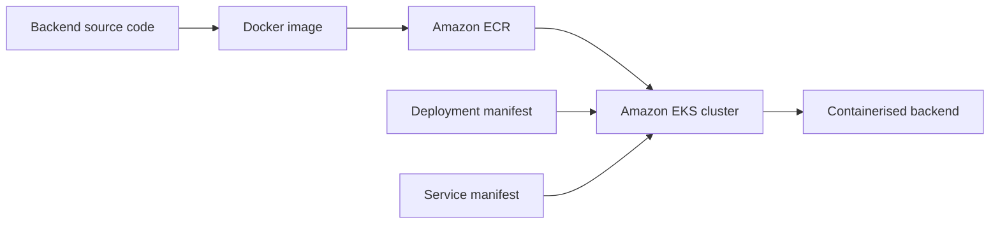

# AWS EKS Kubernetes Deployment Project

This repository documents a four-part hands-on project in which I used **Amazon Elastic Kubernetes Service (EKS)** to deploy a containerised backend application.

The project covered the complete deployment workflow: creating an EKS cluster, building and storing a Docker image, defining Kubernetes resources using manifests and deploying the application with `kubectl`.

This project helped me connect my existing Docker knowledge with Kubernetes and AWS services in a practical cloud environment.

## Project Architecture



## Technologies Used

- **Amazon EKS** - managed Kubernetes cluster
- **Kubernetes** - container orchestration
- **Docker** - container image creation
- **Amazon ECR** - container image registry
- **eksctl** - EKS cluster and node group creation
- **kubectl** - Kubernetes resource deployment and management
- **AWS CloudFormation** - infrastructure provisioned by `eksctl`
- **AWS IAM** - permissions and EKS access management
- **Git and GitHub** - source-code retrieval and project documentation

## Project Stages

### Part 1: Launch an EKS Cluster

In the first part of the project, I created an Amazon EKS cluster and a managed node group using `eksctl`.

I also:

- Configured the AWS permissions required to provision the infrastructure.
- Explored the CloudFormation stacks created by `eksctl`.
- Learnt the difference between an EKS cluster and a managed node group.
- Added an EKS access entry to view and manage the cluster’s nodes.
- Troubleshot issues involving missing tools and insufficient AWS permissions.

[View Part 1: Launch a Kubernetes Cluster](part1_launch_k8s_cluster/legendary-aws-compute-eks1.pdf)

### Part 2: Prepare the Application for Deployment

In the second part, I prepared a backend application so it could be deployed using Kubernetes.

I:

- Cloned the backend application from GitHub.
- Built the application as a Docker container image.
- Created an Amazon ECR repository.
- Tagged and pushed the Docker image to ECR.
- Used ECR as a central location from which Kubernetes could retrieve the image.
- Resolved a Docker permissions issue by adding the EC2 user to the Docker group and refreshing the session.

[View Part 2: Set Up a Kubernetes Deployment](part2_setup_k8s_deployment/legendary-aws-compute-eks2.pdf)

### Part 3: Create Kubernetes Manifests

In the third part, I created the Kubernetes manifest files required to deploy and expose the backend application.

I created:

- A **Deployment manifest** to define how Kubernetes should run and manage the backend containers.
- A **Service manifest** to expose the deployed backend to network traffic.
- A NodePort configuration that routed traffic from port `8080` on the Service to port `8080` on the application container.

The Deployment manifest referenced the Docker image stored in Amazon ECR, allowing the EKS cluster to retrieve and run the containerised application.

[View Part 3: Create Kubernetes Manifests](part3_create_k8s_manifests/legendary-aws-compute-eks3.pdf)

### Part 4: Deploy the Backend

In the final part, I deployed the backend application to the EKS cluster.

I:

- Applied the Deployment and Service manifests using `kubectl`.
- Created the required Kubernetes resources inside the EKS cluster.
- Used the Deployment resource to manage the application containers.
- Used the Service resource to expose the backend application.
- Confirmed that the Kubernetes resources had been successfully created.

[View Part 4: Deploy a Backend with Kubernetes](part4_deploy_backend_with_k8s/legendary-aws-compute-eks4.pdf)

## What I Learnt

Through this project, I developed a better understanding of:

- How an EKS cluster, control plane and managed node group work together.
- The difference between `eksctl` and `kubectl`.
- How `eksctl` uses AWS CloudFormation to provision EKS infrastructure.
- How Docker images move from a build environment into Amazon ECR and then into a Kubernetes deployment.
- How Kubernetes Deployment and Service resources work together to run and expose an application.
- How IAM permissions and EKS access entries affect cluster creation and visibility.
- How to troubleshoot problems involving AWS permissions, missing tools and Docker user access.

## Challenges

The most challenging parts of the project were configuring the required AWS permissions and understanding each section of the Kubernetes Deployment manifest.

I also encountered a Docker permissions error because the EC2 user did not initially have permission to run Docker commands. I resolved this by adding the user to the Docker group and refreshing the EC2 connection session.

Working through these issues improved my troubleshooting skills and helped me understand how AWS identity management, container registries and Kubernetes resources connect across an end-to-end deployment.

## Repository Structure

```text
AWS-EKS-Project/
├── part1_launch_k8s_cluster/
│   └── legendary-aws-compute-eks1.pdf
├── part2_setup_k8s_deployment/
│   └── legendary-aws-compute-eks2.pdf
├── part3_create_k8s_manifests/
│   └── legendary-aws-compute-eks3.pdf
├── part4_deploy_backend_with_k8s/
│   └── legendary-aws-compute-eks4.pdf
└── README.md
```

Each project folder contains a PDF walkthrough with screenshots, explanations and reflections from that stage of the deployment.

## Acknowledgements

This project was completed as part of the [NextWork](https://nextwork.org/) AWS project series.
